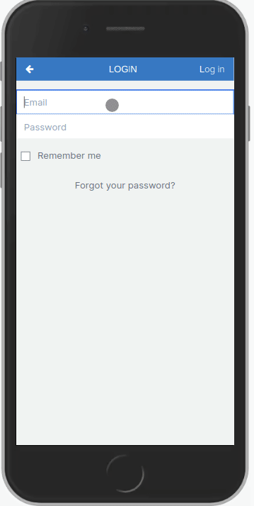

<!-- @format -->


# Budget App

> "Blog App" is a mobile web application where you can manage your budget: you have a list of transactions associated with a category, so that you can see how much money you spent and on what.



## Built With

- Ruby
- Rails
- Postgres

## Getting Started

## Live Demo

[Heroku](https://budget-app-zhadier.herokuapp.com/)

## Video Demo

[Loom](https://www.loom.com/share/4140ea0d2a9b4573a8555e5c754df359)

### To launch the project locally:

#### Step 1:

- Clone this repo locally using git in the command line and the following command

```bash
> git clone git@github.com:zhadier/budget-app.git
```

- Then cd into the directory using

```bash
> cd blog-app
```

- Alternatively, you can just download the complete zip file and extract the folder in your directory

#### Step 2:

- In the project directory, you should download all dependencies using:

```bash
> bundle install
```

- then setup the db using the following command in the CL

```bash
> bin/rails db:setup
```

- Finally, you can use this command to start the live server and checkout the app!

```bash
> bin/rails s
```

## Testing:

To perform tests, run the following command

```bash
> bundle exec rspec spec
```

## Authors

👤 **Zeeshan Haider**

- GitHub: [@zhadier](https://github.com/zhadier)
- LinkedIn: [Zeeshan Haider](https://www.linkedin.com/in/zhadier39/)

## 🤝 Contributing

Contributions, issues, and feature requests are welcome and highly encouraged!
We feel that your input is what helps us grow so you're always Welcome :)

Feel free to check the [issues page](../../issues/).

## Show your support

Give a ⭐️ if you like this project!
I would love to hear your thoughts and ideas 🖤

## 📝 License

This project is [MIT](./MIT.md) licensed.
